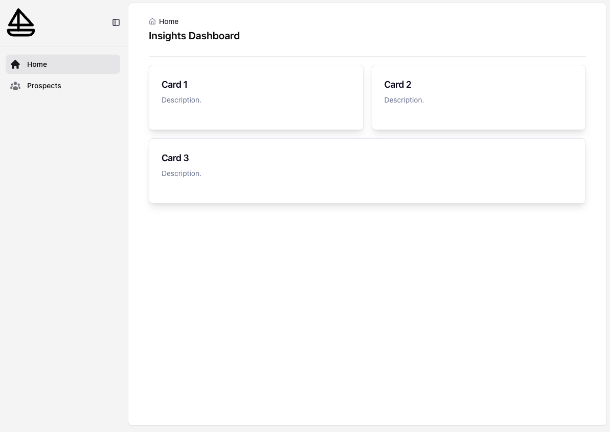
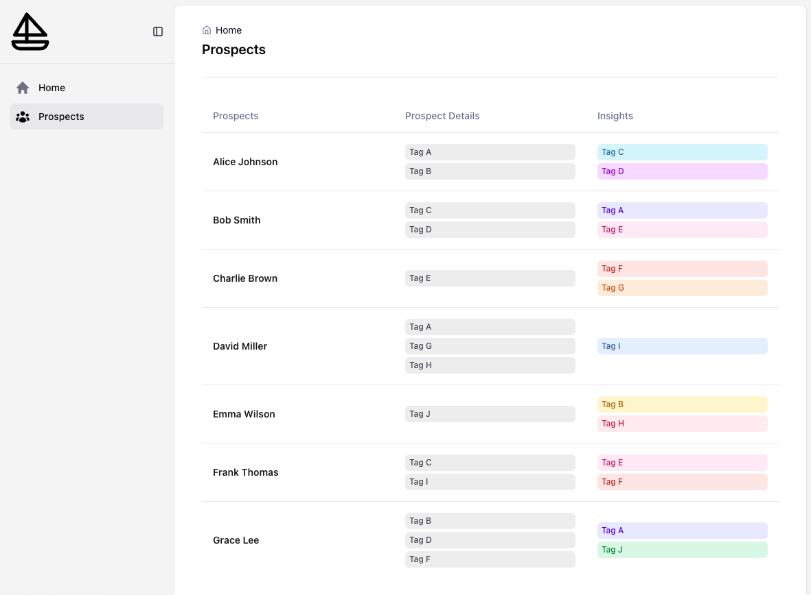

# dashboard_template

In the project directory, you can run the following commands to install the dependencies and run the code. 

### `npm i`
### `npm start`

This runs the app in the development mode.\
Open [http://localhost:3000](http://localhost:3000) to view it in your browser.

The page will reload when you make changes.\
You may also see any lint errors in the console.

## Starter Code

The start code provides two page templates, Home and Prospects, seen below. Use this as a starting point, but feel free to make changes. 

